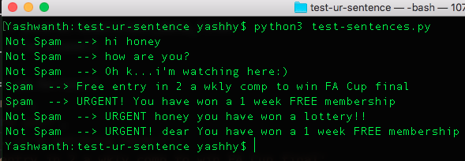

# This code gives an idea of how to test your own sentences and detect if its a spam.
-----

## Problem Statement:

Classify whether your sentences is spam or not

### Steps:
1. I have pickled ([refs](https://stackoverflow.com/a/11218504/1778834), [refs](https://machinelearningmastery.com/save-load-machine-learning-models-python-scikit-learn/)) the trained model from spam-train-test.py
2. Run spam-train-test.py and you will have 'spam_trained_model.pickle' and 'train_data.pickle' in this folder
3. Go to test-sentences.py and type your own sentences, the array variable "sentences"
4. Run the program, you would get whether its spam or not

> After running you will have output like below:

> Note the in the sentence --> "URGENT! You have won a 1 week FREE membership" just adding "honey" or "dear" makes that as normal message.

